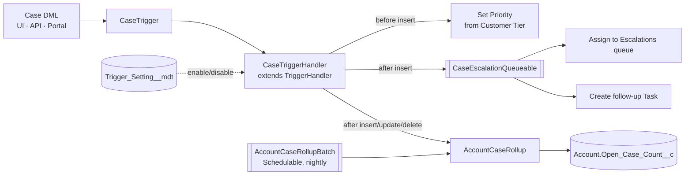

# Salesforce Apex Trigger Framework

A metadata-driven Apex trigger framework with bulk-safe synchronous logic and asynchronous follow-up work (Queueable, Batch, Schedulable).

> **Representative portfolio project.** Written independently for demonstration with synthetic data. It is not code from, and does not describe the internal design of, any employer or client.

## Business problem

Support desks that serve homeowners and field technicians need case priority set consistently, urgent cases escalated immediately, and account-level workload visible to managers. In many orgs this logic ends up scattered across several triggers, Process Builders and Flows that fight each other, hit governor limits on bulk loads, and cannot be switched off during a data migration.

This project shows one maintainable way to structure that logic.

## What it demonstrates

| Capability | Where |
|---|---|
| One-trigger-per-object pattern with a virtual base handler | `TriggerHandler.cls`, `CaseTrigger.trigger` |
| Switch handlers off without a deployment (Custom Metadata) | `Trigger_Setting__mdt`, `TriggerHandler.isEnabledInMetadata` |
| Programmatic bypass for data loads and recursion guard | `TriggerHandler.bypass`, `maxLoops` |
| Bulk-safe logic – one query per context, no SOQL/DML in loops | `CaseTriggerHandler.cls`, `AccountCaseRollup.cls` |
| Asynchronous escalation with Queueable Apex | `CaseEscalationQueueable.cls` |
| Nightly drift correction with Batch + Schedulable | `AccountCaseRollupBatch.cls` |
| User-mode data access (`WITH USER_MODE`, `AccessLevel.USER_MODE`) | all service classes |
| Partial-success DML with structured error logging | `Logger.cls` |
| Apex tests: bulk (200 records), bypass, metadata toggle, async | `*Test.cls` |

## Architecture



### Business rules (synthetic)

- Cases created through self-service channels (`Origin` = Web or Portal) get a priority from the account's `Customer_Tier__c`: Platinum → High, Gold → Medium, Standard → Low. Agent-created cases keep the agent's choice.
- High-priority cases are moved to the `Escalations` queue and a follow-up Task is created for the account owner, asynchronously.
- `Account.Open_Case_Count__c` is kept current on insert, close/reopen, re-parenting, delete and undelete, and fully recalculated nightly.

## Tech stack

Apex · SOQL aggregate queries · Custom Metadata Types · Queueable / Batch / Schedulable Apex · Salesforce DX · GitHub Actions · Prettier (Apex parser)

## Setup

Prerequisites: [Salesforce CLI](https://developer.salesforce.com/tools/salesforcecli), a Dev Hub-enabled org (a free Developer Edition works), Node 20+.

```bash
git clone https://github.com/saisusmithamullapudi-svg/salesforce-apex-trigger-framework.git
cd salesforce-apex-trigger-framework
npm install

sf org login web --set-default-dev-hub --alias devhub
sf org create scratch --definition-file config/project-scratch-def.json --alias trigger-demo --set-default
sf project deploy start
sf apex run --file scripts/seed-data.apex        # optional synthetic data
npm run test:apex                                # run all Apex tests with coverage
```

Turn the handler off without deploying: **Setup → Custom Metadata Types → Trigger Setting → Case → uncheck Active**.

## Adding a handler for another object

```apex
trigger OpportunityTrigger on Opportunity(before insert, before update, after insert, after update) {
    new OpportunityTriggerHandler().run();
}

public with sharing class OpportunityTriggerHandler extends TriggerHandler {
    protected override void beforeUpdate(List<SObject> newRecords, Map<Id, SObject> oldMap) {
        // bulk-safe logic here
    }
}
```

## Testing

| Test | What it proves |
|---|---|
| `derivesPriorityFromCustomerTier` | Tier → priority mapping for self-service cases |
| `keepsAgentPriorityForPhoneCases` | Agent input is never overwritten |
| `escalatesHighPriorityCasesAsynchronously` | Queueable runs and creates follow-up Tasks |
| `maintainsOpenCaseCountInBulk` | 200-record insert, close and delete keep the rollup correct |
| `bypassSkipsHandler` / `metadataCanDisableHandler` | Both off-switches work |
| `correctsDriftForAllAccounts` | Batch repairs counts after a bypassed load |

Apex tests need an org and are run locally with npm run test:apex. GitHub Actions (.github/workflows/main.yml) checks Apex formatting on every push.

## Security considerations

- Classes run `with sharing` / `inherited sharing`; queries use `WITH USER_MODE` and DML uses `AccessLevel.USER_MODE`, so CRUD, FLS and sharing are enforced.
- No credentials, org IDs or endpoints are stored in the repository; CI authenticates with JWT secrets held in GitHub.
- All data in tests and seed scripts is synthetic.

## Limitations and future enhancements

- The Logger writes to the debug log only; a production version would publish a Platform Event or write to a log object.
- Recursion guard is per handler and context; some designs need per-record guards.
- Future: handler ordering via metadata, a Flow-invocable bypass, and PMD / Salesforce Code Analyzer in CI.

## License

MIT – see [LICENSE](LICENSE).
